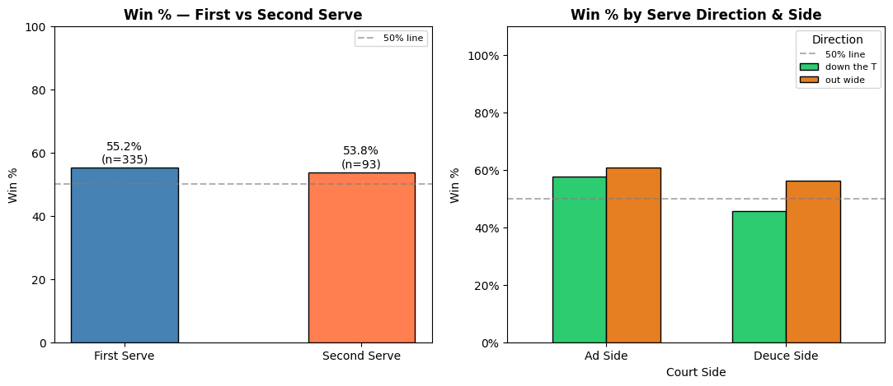
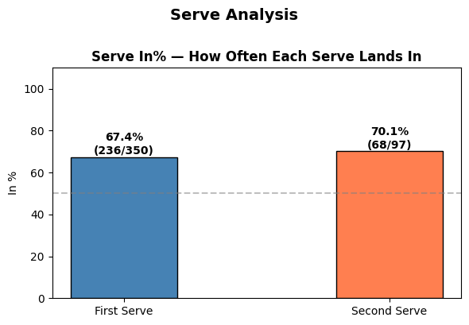
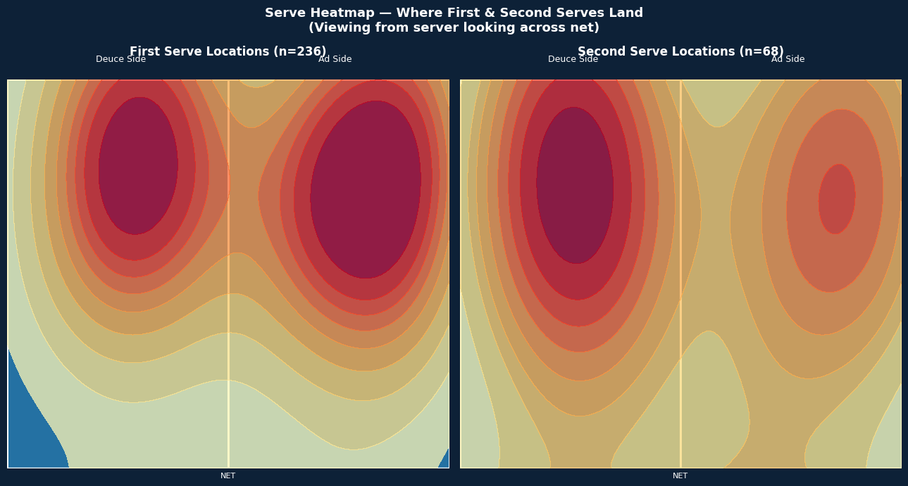
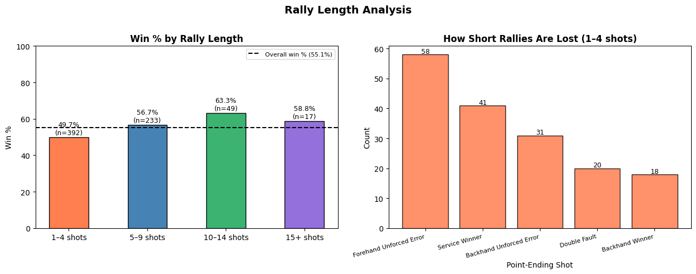
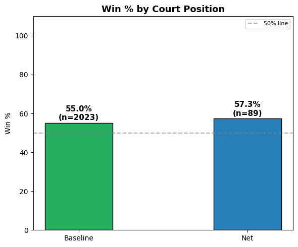
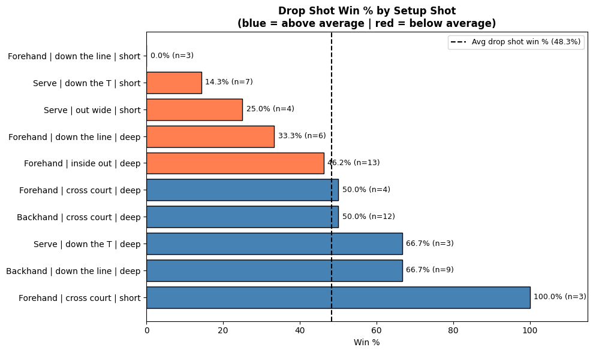
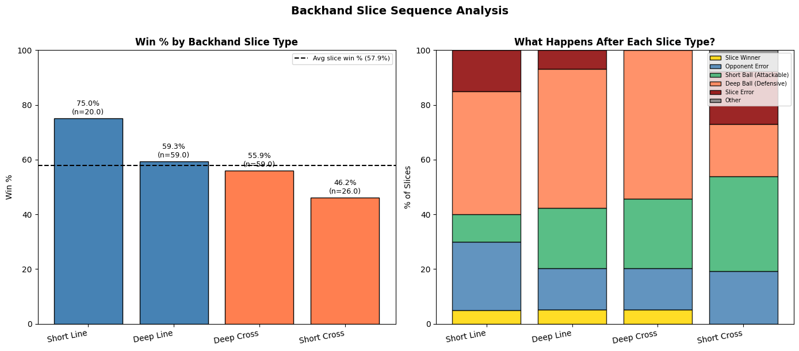

# Tennis Match Analysis Project

## Overview

This project analyzes personal tennis match data collected through SwingVision in order to better understand patterns in serving, rally construction, positioning, and shot selection.

The goal of this project is to use data science techniques to identify what strategies contribute most to winning points and where improvements can be made.

However, to understand this project for non-tennis fans, I've created a brief but hopefully useful quick guide to the language used to understand this project better. 
tennis_background_knowledge.md 

---

# Serve Analysis

## First vs. Second Serve Performance

One of the first questions I wanted to explore was whether my first serve actually creates a measurable advantage compared to my second serve. I also looked at serve direction, specifically whether hitting wide, body, or down the T differs between the deuce and ad side.

**Coding note:** SwingVision records the serve bounce zone as 'ad', 'deuce', or 'center_line'. I mapped 'center_line' to 'deuce' because a serve down the T on the deuce side bounces near the center line, they represent the same tactical zone. Any bounce zones outside those three get filtered out so they don't skew the results.

**First vs Second Serve:** My win % in relation to my first vs second serve isn't optimal. "Good servers" will have very high first serve win percentages around 70–90%. This tells me I need to increase both my speed of serve as well as my directional accuracy to have more impact and start the point in an aggressive position. However, for my second serve to sit anywhere above 51% is good enough. While I will still look to improve my second serve to push this number higher, having it above 51% means I am still winning the majority of those points.

**Direction by Side:** These results are interesting in that on both sides, my out wide serve consistently gives the best results. This tells me that regardless of my opponent's strongest stroke, my best bet is to move them off the court and out of position. The down the T serve on the deuce side is particularly concerning at only 45.7% (below 50%) meaning that serve actively loses me more points than it wins. This is likely because it's a predictable direction on that side and opponents are reading it and attacking it.

---

# Serve Placement Heatmap

Another area I explored was exactly where my serves are landing.

**Coding note:** I used a KDE (Kernel Density Estimate) heatmap layered on top of a drawn service box to show where my serves cluster. The service box coordinates required careful calibration to match SwingVision's coordinate system, which turned out to be one of the harder parts of this project.

**Heatmap:** Ideally the hot zones would shift toward the wide corners of each service box, which would match the direction data showing out wide is my highest win % serve. Instead, most of my serves cluster toward the middle of the service box, and when they do skew wide, it's inconsistent. This gap between what works and what I actually do is one of the most actionable findings in this entire analysis. I need to be more intentional about targeting the wide corners rather than defaulting to the center of the box.

---

# Rally Length Analysis

## Short vs. Long Rallies

I grouped rallies into four categories based on shot count to better understand which point structures favor my game style:

- **1–4 shots** = short / serve-dominated points
- **5–9 shots** = medium rallies
- **10–14 shots** = longer exchanges
- **15+ shots** = extended baseline battles

**Coding note:** I counted "rally length" as the highest shot number recorded in a point. I then used `pd.cut()` to sort each point into one of those four buckets. The second chart zooms in on how short rallies are lost, which matters because 1–4 shot points are often serve + one or two shots, so errors there can be very costly.

**Rally Length Efficiency:** My win percentage by rally length tells me I need more time building a point to win. I am losing the battle of the first four shots at 49.7%, which is below 50%. Yet I peak at a 63.3% win rate in 10–14 shot rallies. This tells me that while my fitness and consistency are useful, I am not starting points in a neutral or aggressive enough position to capitalize on my endurance.

**Error Analysis:** The breakdown of how short rallies are lost highlights a significant leak: my forehand. With 58 forehand unforced errors serving as the primary cause of lost short points, it's clear I am over-pressing on the "+1" ball. To bring my short-rally win percentage above 50%, I must prioritize directional accuracy over reckless power early in the point. Cutting down on these early forehand errors, along with the 20 double faults also visible in the data, would stop handing opponents free points before the rally even begins.

---

# Net vs. Baseline

I also compared point outcomes when approaching the net versus staying at the baseline.

**Coding note:** I define "net" as any shot that is a volley or overhead (FH Volley, BH Volley, Overhead). Everything else is counted as baseline. This is a minor simplification as it classifies by shot type rather than exact court position but it gives a reasonable picture of how net play compares to baseline play.

Because my net win % is higher than my baseline win %, it suggests net approaches are more effective. While the sample size at net is significantly smaller than the baseline data, I still believe it is large enough to give a reasonable result. The 50% dotted gray line again represents the minimum threshold where anything below it would suggest an ineffective strategy.

Although net approaches occur less frequently, they result in a higher success rate overall. This may suggest that I should look for more opportunities to transition forward during matches.

---

# Drop Shot Analysis

## What Setup Creates the Best Drop Shot Opportunity?

SwingVision doesn't have a "drop shot" label, so I defined it using three rules: the ball bounces short, the spin is slice, and the speed is under 35 mph. This combination filters out regular slices and short balls that weren't intentional. I then looked back two shots to find the setup (what I hit immediately before the drop shot) and checked whether that setup led to winning the point.

**Drop Shot Setup Efficiency:** My overall drop shot win rate sits at 48.3%, which is just below the 50% threshold, technically suggesting I shouldn't hit it. Honestly, with this being my favorite shot I highly doubt I will actually hit it less. However, looking closer at the setup data, there are easy ways I can make up the 2.7% difference.

Setting up the drop shot with a Backhand Down the Line (Deep) or a Serve Down the T (Deep) yields a win percentage of 66.7%, likely because those shots push the opponent back or out of the court, creating the space needed. In contrast, attempting a drop shot after a short serve is very ineffective, with win rates as low as 14.3%. This suggests that if I haven't earned the right to use the drop shot by first pushing my opponent deep, I am essentially handing them a mid-court ball they can easily punish.

**A note on sample sizes:** Many of these setup categories have small sample sizes (n=3 or n=4), so some of the extreme numbers like a 100% win rate on Forehand Cross Court (Short) may be outliers rather than reliable patterns. The most trustworthy finding is the 46.2% win rate after a Forehand Inside Out (Deep) at n=13, which tells me my most common setup shot for the drop shot is currently performing slightly below average.

---

# Backhand Slice Analysis

## What Is My Most Effective Backhand Slice?

This section looks at my backhand slice in detail. I broke it into four tactical types based on depth and direction: Deep Cross, Deep Line, Short Cross, and Short Line, and tracked what my opponent does after each type.

**Coding note:** The most complex part here was building the 3-shot sequence: my slice → opponent's response → what I do next. I looped through each slice, looked it up in the full match data (including opponent shots), and classified the opponent's response into categories like "Opponent Error", "Short Ball (Attackable)", and "Deep Ball (Defensive)". This kind of sequence analysis is harder than simple win/loss because it requires matching shot records across both players.

**Backhand Slice Effectiveness:** The data identifies the Short Line slice as my most effective variation with a 75.0% win rate. The "What Happens After" chart explains why as this shot induces the highest rate of immediate Opponent Errors and outright Slice Winners. By bringing my opponent forward and out of their comfort zone on the line, I am forcing errors rather than simply neutralizing the point. In contrast, the Short Cross slice is my least effective at 46.2%, primarily because it leaves a large portion of the court open for an attackable reply.

**Data Reliability:** The Deep Line and Deep Cross slices provide the most reliable data at n=59 each, both hovering around a 57.9% win rate. While the Short Line has a smaller sample (n=20), its high success rate suggests it is a viable "change-up" shot. The takeaway: use deep cross-court slices to build the point and look for the short-line variation as a deliberate tactical play to force a direct error.

---

# Challenges

One of the biggest challenges in this project was transforming raw match data into meaningful tennis concepts. Many tactical ideas in tennis are not directly labeled in the dataset, so I had to create my own definitions and categories.

For example:
- Identifying drop shots required combining bounce depth, spin type, and speed since there is no "drop shot" column in SwingVision
- The host/guest role logic for determining point winners required understanding how SwingVision assigns match roles, which flip depending on who served first
- Normalizing coordinates so that all shots pointed in the same direction using a `fix_coordinates()` function
- Building multi-shot sequences for drop shots and slices, which meant cross-referencing rows across both the shots and points tables, and across both players
- Calibrating the heatmap coordinates to match SwingVision's coordinate system accurately

Another challenge was balancing technical analysis with readability. I wanted the project to remain understandable even for readers without coding or tennis backgrounds.

---

# Final Reflection

## Coding Process

This project involved working with real, imperfect sports data which turned out to be one of the most valuable learning experiences.

**Things that were harder than expected:**
- The host/guest role logic for determining point winners which required understanding how SwingVision assigns match roles
- Building multi-shot sequences for drop shots and slices, which meant cross-referencing rows across both the shots and points tables, and across both players
- Normalizing coordinates so that all shots pointed in the same direction
- Building the heatmap and getting the service box proportions right

**Things that were easier than expected:**
- Once the master data tables were built, `groupby` operations in pandas were very readable and didn't require much code
- K-Means was surprisingly straightforward to apply — the sklearn library handles most of the math
- Once I got the hang of bar charts, much of the code became templated and faster to write

---

# Conclusion

This project helped demonstrate how sports performance data can reveal patterns that are difficult to notice during actual competition. By combining tennis knowledge with data science techniques, I was able to identify both strengths and weaknesses in my own game.

The most useful outputs aren't the individual stats but the comparisons. The first vs second serve win %, baseline vs net win %, and rally length win % together tell a story about where in a point I am most and least comfortable. What makes this analysis valuable is that it is all based on real match data from real competitive points. Most tennis feedback is qualitative ("my forehand feels off today"). This project makes it quantitative: forehand errors are the primary reason short rallies are lost, and setting up drop shots with deep shots nearly doubles their success rate. Those are specific, actionable findings.

Going forward, I would like to explore opponent-specific patterns, score-state performance (does my win % drop on break points?), and eventually build a classifier that predicts whether a shot will be a winner or an error based on speed, direction, and depth. I also want to refine this so other players can plug in their own SwingVision data and run the same analysis on their matches.
